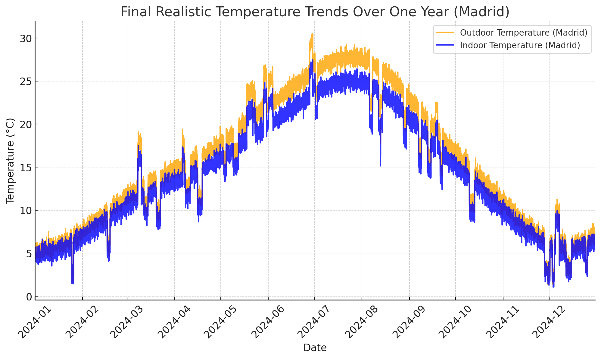

This model tries tp predict the optimañ hour in a day to ventilate the house in order to safe energy consumtion (heater or AC) as well as to ventilate the house on hotter hours of the day in winter time and the coldest hours in summer time.

## The Goal

We want to predict the optimal hour in a day to ventilate the house, based on:

- Outdoor and indoor temperature trends (cooler outdoor temperatures relative to indoor).
- Daily patterns (e.g., mornings/evenings might be cooler).
- Seasonal changes (winter vs. summer behavior).

## Choosing a model

Between a **Regression model** and a **Time-Series model**

- *Regression* models assume that features (temperarture, humidity, wind speed) have a direct relationship withe the target(output) variable- optimal ventilation time.

- *Time-series* models consider the order of data points over time, meaning that they analyse trends, seasonality, and patterns based on past observation.

Since our data consists of temperarure changes throught the day, a time-series could detect patterns (e.g., when outdoor temperature is lower than indoor temperature) asnd make precise predictions for optimal ventilation time.

#### Some Time-series models available

- 1. Moving Averages & Exponential Smoothing. Smooth fluctuations in data

- 2. ARIMA (AutoRegressive Integrated Moving Average) - A powerful statistical model that captures trends and seasonality.

- 3. LSTMs(Long Short-Ter Memory Networks) - A Deep Learning approach that learns from sequential data and long-term dependencies.

- 4. Prophet (by Facebook) - A model designed for handling time-series data with seasonal patterns.

Next Steps to Improve Realism:
Introduce random fluctuations (up/down deviations) to simulate unexpected daily variations.
Add occasional heatwaves/cold fronts, where temperature rises/falls unusually for a few days.
Ensure fluctuations aren't too extreme—they should feel like natural weather patterns.

## Frameworks and Libaries
- pandas 
- numpy 
- matplotlib 
- seaborn 
- scikit-learn 
- statsmodels 
- fbprophet 
- tensorflow
